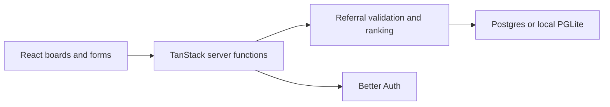

# RideRelay

A community board for sharing Lime and Veo referral invites. Browse an invite, list your own, and share your RideRelay link to move up the board.

## What it does

- Lists Lime invite links and Veo codes on provider-specific boards.
- Lets visitors copy or open a referral to use with the provider.
- Tracks arrivals through shared RideRelay links to calculate ranking.
- Excludes self-claims and repeat visits from the same browser from share credit.
- Places creator listings at the top as a way to support the creator.

Share counts are browser-based signals, not verified unique people or proof that a ride occurred. Provider eligibility and referral rewards remain outside this application.

## Quick start

Use Node.js 22.12+ and npm. The test script uses Node's built-in TypeScript stripping.

```bash
git clone https://github.com/aiden-guan/riderelay.git
cd riderelay
npm ci
VITE_AUTH_ENABLED=false npm run dev
```

Open [localhost:8080](http://localhost:8080). For this local demo, leave `DATABASE_URL` unset. Embedded PGLite applies the bundled migrations automatically and keeps data in memory; restarting the server clears that data. The explicit auth flag enables the local development identity, not a real sign-in flow.

## Verify changes

```bash
npm test
npm run typecheck
npm run lint
npm run build:dev
```

`build:dev` compiles without running the separate database migrator. **`npm run build` also runs `db:migrate`, which applies pending SQL to `DATABASE_URL` when configured.** Only point that command at a database you intend to migrate. With no database URL, the migrator skips and local PGLite bootstraps on startup.

With the local dev server running, check auth-flag consistency in a second terminal:

```bash
VITE_AUTH_ENABLED=false npm run check:auth
```

Current verification limits: the full test command has failures in template checks, including references to `.grok` files absent from the public repository; because the script chains its two stages, those failures prevent the application tests from running in that command. Lint also reports an existing empty-block error in `src/lib/app-data/client.server.ts`. Typecheck, `build:dev`, the local auth-flag check, and all 77 application tests (run separately) passed during this documentation pass. The local homepage returned HTTP 200 with RideRelay content.

## Architecture and decisions

React 19 and TanStack Router/Start provide the UI and server functions. Vite builds the application; Tailwind CSS and Radix components provide styling and controls. Server-side SQL runs through `pg` for configured Postgres or PGLite for local development. Better Auth handles the configured sign-in integration.



| Location | Purpose |
| --- | --- |
| [src/routes](src/routes) | Provider boards, sharing, dashboard, and policy pages |
| [src/lib/referrals](src/lib/referrals) | Validation, allocation, authorization, ranking, and share rules |
| [src/lib/server](src/lib/server) | Server API and helpers |
| [src/lib/db.ts](src/lib/db.ts) | SQL abstraction and embedded database bootstrap |
| [migrations](migrations) | Schema and seed SQL |
| [src/lib/auth](src/lib/auth) | Sessions, identity, and sign-in integration |

## Deployment configuration

Persistent deployments need `DATABASE_URL` and real authentication configuration. The current federation integration expects a Grok authentication broker; a plain clone does not provision that service or its OAuth client.

The server reads `BETTER_AUTH_URL`, `BETTER_AUTH_SECRET`, `GROK_AUTH_ISSUER`, `GROK_AUTH_CLIENT_ID`, and `GROK_AUTH_CLIENT_SECRET`. Obtain broker credentials from the provider and keep secrets in the deployment environment. Set `VITE_AUTH_ENABLED=true` for configured authentication; `VITE_` values are browser-visible and must never hold secrets. Auth disabled with a configured database fails closed for protected operations.

See [the auth server](src/lib/auth/server.ts) and [migration runner](scripts/migrate.mjs) for the current integration contract. A production deployment and authenticated referral flow have not been verified by this documentation pass.

## Status and limits

This repository includes application code, SQL migrations, and automated checks. No verified live demo or product screenshot is included in this README. The local development identity is suitable only for local exploration; it does not verify multi-user behavior or broker login. Browser-based share deduplication does not establish comprehensive abuse prevention.

No license file is currently included.
